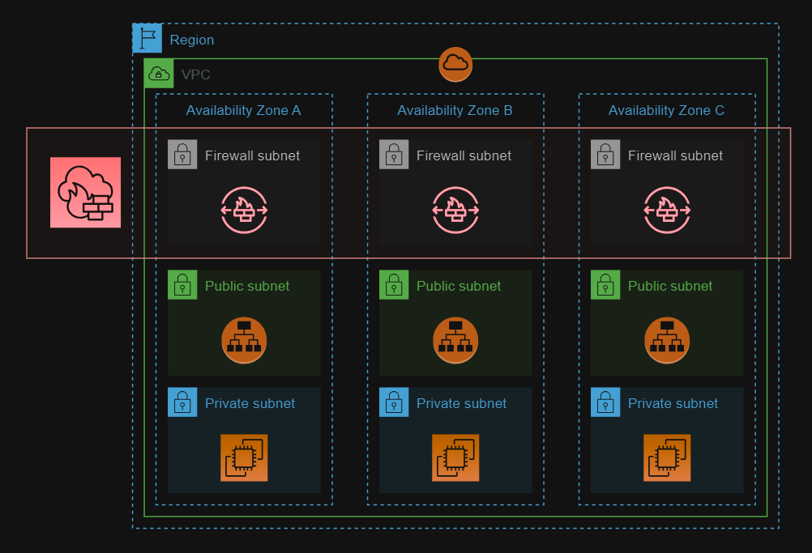

# AWS Network Firewall

Protecting inbound and outbound traffic in a VPC using AWS Network Firewall.



Create the resources:

```
terraform init
terraform apply
```

To test inbound drop, set your IP address in the `.auto.tfvars` file:

```terraform
ip_to_drop = "1.2.3.4"
```
